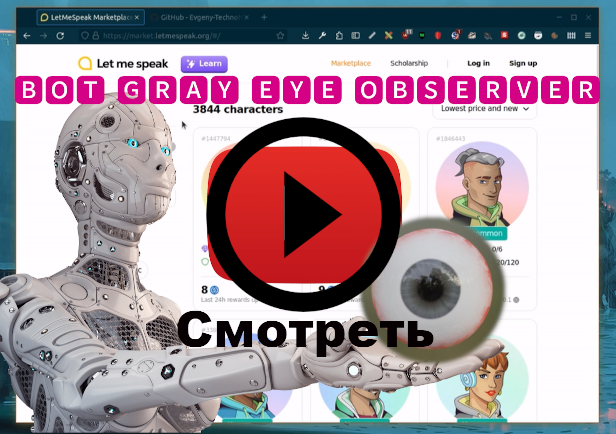

# Gray eye observer bot


**Бот для мессенджера Telegram. Это индивидуальный бот. Помогает отслеживать NFT персонажей.**

На сайте [letmespeak](https://market.letmespeak.org/)  делаете фильтр персонажа, передаёте боту получившийся url, 
следуете инструкциям бота. Как только появятся изменения товара 
по фильтру, бот пришлёт уведомления. **Работает через прокси**. Это индивидуальный бот, 
его можно разместить как у себя на машине, так и на [VPS](https://ru.wikipedia.org/wiki/VPS)

## Локальная установка
**У вас должны быть рабочие приватные прокси**

0. Установить Python и Git [(как)](https://www.google.com/)
1. Создать виртуальное окружение и активировать его
```shell
python3 -m venv venv
source venv/bin/activate
```
2. Клонировать себе репозиторий
```shell
git clone https://github.com/Evgeny-TechnoNinja/gray-eye-observer.git
```
3. Перейти в каталог `gray-eye-observer`
```shell
cd gray-eye-observer
```
4. Сделать копию файла `.env.example`
```shell
cp .env.example .env
```
5. Отредактировать файл `.env`
```.env
TELEGRAM_TOKEN=Создайте бота и укажите здесь токен, который вы получите при создании бота (см. пунк №6)
BOT_ADMIN= Ваш ID в телеграме. Можно посмотреть, запустив бота https://t.me/getmyid_bot
PROXIES=Укажите приватные прокси с портом в формате ip:port, ip:port
PROXY_LOGIN=Будет вместе с прокси
PROXY_PASSWORD=Будет вместе с прокси
```
Смотри видео ниже, как это делаю я
6. Создать бота в Telegram. Как это сделать - смотри видео ниже, или [(тут)](https://www.google.com/)
Укажите имя боту `GrayEyeObserver<любой ваш номер>` прошу сделать так по эстетическим соображениям,
потому что я бота назвал `Gray Eye Observer`. Если не согласны - любое ваше имя. 
Не забудьте скопировать токен, и вписать в файл `.env` в поле `TELEGRAM_TOKEN`  
7. Перейти в каталог `app`
```shell
cd app
```  
8. Запустить скрипт `app.py`
```shell
python app.py
```  
9. Перейти в Telegram и запустить только что созданного бота
10. Следуй инструкциям бота или смотри видео ниже

### Инструкция и демонстрация
[](https://youtu.be/Q-EC04QKuRQ)

**Находится в стадии тестирования**
